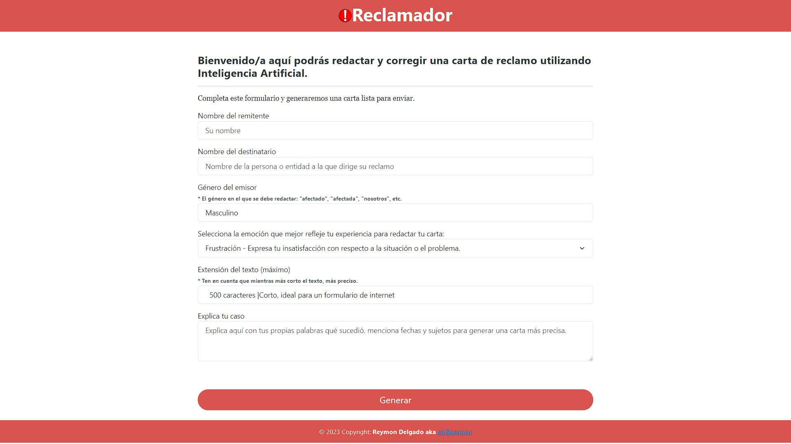
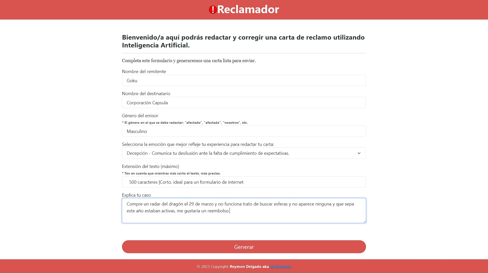
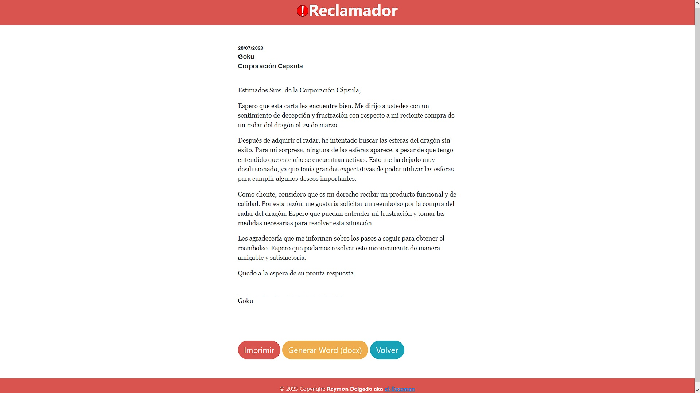

# Reclamador

Reclamador es una aplicación que permite a los usuarios generar un documento de reclamo de manera sencilla y eficiente. Ya sea por un producto, un servicio o algún malentendido, Reclamador utiliza inteligencia artificial para crear un documento elocuente y bien redactado, listo para ser firmado o enviado.

## Características

- Generación de documentos de reclamo personalizados.
- Utilización de inteligencia artificial para mejorar la redacción y ortografía del documento.
- Opciones para descargar, firmar o enviar el reclamo directamente desde la aplicación.
- El formulario cuenta con una variedad de emociones para que el usuario exprese su frustración, decepción, etc. en la carta de manera adecuada y personalizada.
- Implementación simple y flexible utilizando CDN para la carga de recursos externos.
- Capacidad para personalizar y agregar recursos adicionales como CSS, React o Angular según las necesidades del usuario.
- Interfaz intuitiva y fácil de usar para una experiencia de usuario agradable.

## Tecnologías Utilizadas

- Python
- Django
- OpenAI GPT-3.5
- HTML
- CSS
- JavaScript

## Instalación

1. Clona este repositorio en tu máquina local.
2. Instala Django y OpenAI
    - `pip install Django`
    - `pip install openai`

3. Añade tu api_key en AI.py `Reclamador/ReclamadorApp/AI.py`
4. Ejecuta la aplicación localmente utilizando [python manage.py runserver].

## Uso

1. Ingresa a la aplicación y completa el formulario de reclamo con los datos requeridos.
   
2. La inteligencia artificial procesará la información y generará un documento de reclamo.
3. El documento estará listo para ser visualizado en pantalla, impreso o generado en formato Word (docx).
    

## Contribución

Si deseas contribuir al desarrollo de Reclamador, sigue los siguientes pasos:

1. Realiza un fork de este repositorio.
2. Crea una nueva rama para tu contribución.
3. Realiza los cambios y mejoras en tu rama.
4. Realiza un pull request para que podamos revisar tus cambios.

## Notas

- El objetivo de simplificar el proyecto es permitir que cualquier persona pueda abrirlo, incluso sin tener mucho conocimiento de programación.
- Soy consciente de que la generación de la carta puede tardar, estoy considerando añadir una pantalla de carga, aún no estoy seguro de cómo implementarla manteniendo la idea de simplicidad.
- Sé que es un poco arriesgado permitir que la IA escriba HTML, pero es la mejor solución que he encontrado hasta el momento.

## Licencia

Este proyecto está bajo la Licencia MIT. [LICENSE](/LICENSE)
